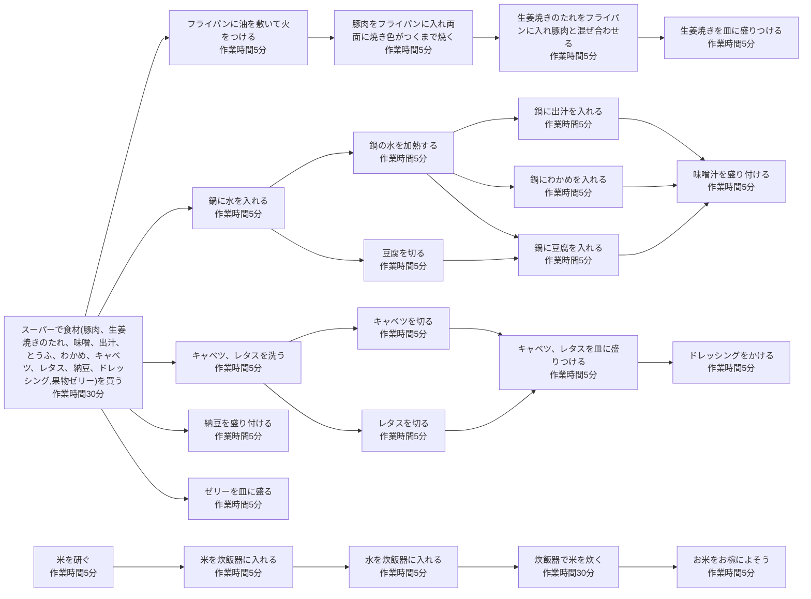

```mermaid
flowchart LR
    super["スーパーで食材(豚肉、生姜焼きのたれ、味噌、出汁、とうふ、わかめ、キャベツ、レタス、納豆、ドレッシング,果物ゼリー)を買う
    作業時間30分"]
    rise1["米を研ぐ
    作業時間5分"]
    rise2["米を炊飯器に入れる
    作業時間5分"]
    rise3["水を炊飯器に入れる
    作業時間5分"]
    rise4["炊飯器で米を炊く
    作業時間30分"]
    rise5["お米をお椀によそう
    作業時間5分"]
    rise1-->rise2
    rise2-->rise3
    rise3-->rise4
    rise4-->rise5
    meat1["フライパンに油を敷いて火をつける
    作業時間5分"]
    meat2["豚肉をフライパンに入れ両面に焼き色がつくまで焼く
    作業時間5分"]
    meat3["生姜焼きのたれをフライパンに入れ豚肉と混ぜ合わせる
    作業時間5分"]
    meat4["生姜焼きを皿に盛りつける
    作業時間5分"]
    super-->meat1
    meat1-->meat2
    meat2-->meat3
    meat3-->meat4
    miso1["鍋に水を入れる
    作業時間5分"]
    miso2["鍋の水を加熱する
    作業時間5分"]
    miso3["豆腐を切る
    作業時間5分"]
    miso4["鍋に出汁を入れる
    作業時間5分"]
    miso5["鍋にわかめを入れる
    作業時間5分"]
    miso6["鍋に豆腐を入れる
    作業時間5分"]
    miso7["味噌汁を盛り付ける
    作業時間5分"]
    super-->miso1
    miso1-->miso2
    miso1-->miso3
    miso3-->miso6
    miso2-->miso4
    miso2-->miso5
    miso2-->miso6
    miso4-->miso7
    miso5-->miso7
    miso6-->miso7
    sarada1["キャベツ、レタスを洗う
    作業時間5分"]
    sarada2["キャベツを切る
    作業時間5分"]
    sarada3["レタスを切る
    作業時間5分"]
    sarada4["キャベツ、レタスを皿に盛りつける
    作業時間5分"]
    sarada5["ドレッシングをかける
    作業時間5分"]
    sarada6["納豆を盛り付ける
    作業時間5分"]
    super-->sarada1
    super-->sarada6
    sarada1-->sarada2
    sarada1-->sarada3
    sarada2-->sarada4
    sarada3-->sarada4
    sarada4-->sarada5
    zeri["ゼリーを皿に盛る
    作業時間5分"]
    super-->zeri
    
```