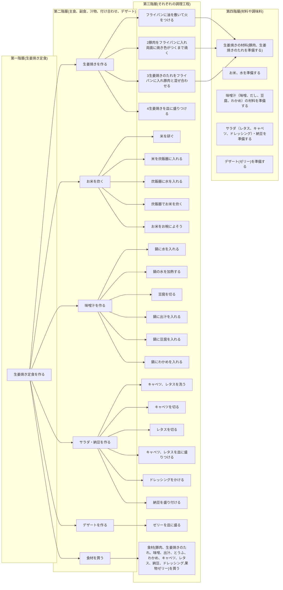

```mermaid
graph LR;
subgraph "第一階層(生姜焼き定食)"
    cook_teisyoku["生姜焼き定食を作る"]
end
subgraph "第二階層(主食、副食、汁物、付け合わせ、デザート)"
    cook_syougayaki["生姜焼きを作る"]
    cook_kome["お米を炊く"]
    cook_soup["味噌汁を作る"]
    cook_sarada["サラダ・納豆を作る"]
    cook_dezert["デザートを作る"]
    buy_syokuzai["食材を買う"]
end

subgraph "第三階層(それぞれの調理工程)"
        1_syougayaki["フライパンに油を敷いて火をつける"]
        2_syougayaki["2豚肉をフライパンに入れ両面に焼き色がつくまで焼く"]
        3_syougayaki["3生姜焼きのたれをフライパンに入れ豚肉と混ぜ合わせる"]
        4_syougayaki["4生姜焼きを皿に盛りつける"]

        1_okome["米を研ぐ"]
        2_okome["米を炊飯器に入れる"]
        3_okome["炊飯器に水を入れる"]
        4_okome["炊飯器でお米を炊く"]
        5_okome["お米をお椀によそう"]
        
        1_soup["鍋に水を入れる"]
        2_soup["鍋の水を加熱する"]
        3_soup["豆腐を切る"]
        4_soup["鍋に出汁を入れる"]
        5_soup["鍋に豆腐を入れる"]
        6_soup["鍋にわかめを入れる"]

        1_sarada["キャベツ、レタスを洗う"]
        2_sarada["キャベツを切る"]
        3_sarada["レタスを切る"]
        4_sarada["キャベツ、レタスを皿に盛りつける"]
        5_sarada["ドレッシングをかける"]
        6_sarada["納豆を盛り付ける"]

        1_zeri["ゼリーを皿に盛る"]

        1_buy["食材(豚肉、生姜焼きのたれ、味噌、出汁、とうふ、わかめ、キャベツ、レタス、納豆、ドレッシング,果物ゼリー)を買う"]
end

subgraph "第四階層(材料や調味料)"
    1_zyunbi_syougayaki["生姜焼きの材料(豚肉、生姜焼きのたれを準備する)"]
    2_zyunbi_okome["お米、水を準備する"]
    3_zyunbi_soup[味噌汁（味噌、だし、豆腐、わかめ）の材料を準備する]
    4_zyunbi_sarada["サラダ（レタス、キャベツ、ドレッシング）・納豆を準備する"]
    5_zyunbi_zeri["デザート(ゼリー)を準備する"]

end

cook_teisyoku --> cook_syougayaki;
cook_teisyoku --> cook_kome;
cook_teisyoku --> cook_soup;
cook_teisyoku --> cook_sarada;
cook_teisyoku --> cook_dezert;
cook_teisyoku --> buy_syokuzai;

 cook_syougayaki --> 1_syougayaki;
 cook_syougayaki --> 2_syougayaki;
 cook_syougayaki --> 3_syougayaki;
 cook_syougayaki --> 4_syougayaki;

cook_kome --> 1_okome;
cook_kome --> 2_okome;
cook_kome --> 3_okome;
cook_kome --> 4_okome;
cook_kome --> 5_okome;

 cook_soup --> 1_soup;
 cook_soup --> 2_soup;
 cook_soup --> 3_soup;
 cook_soup --> 4_soup;
 cook_soup --> 5_soup;
 cook_soup --> 6_soup;

 cook_sarada --> 1_sarada;
 cook_sarada --> 2_sarada;
 cook_sarada --> 3_sarada;
 cook_sarada --> 4_sarada;
 cook_sarada --> 5_sarada;
 cook_sarada --> 6_sarada;

cook_dezert --> 1_zeri;

buy_syokuzai --> 1_buy;

1_syougayaki --> 1_zyunbi_syougayaki
2_syougayaki --> 1_zyunbi_syougayaki
3_syougayaki --> 1_zyunbi_syougayaki

``` 